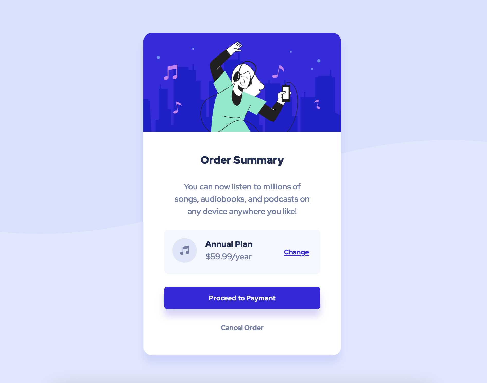
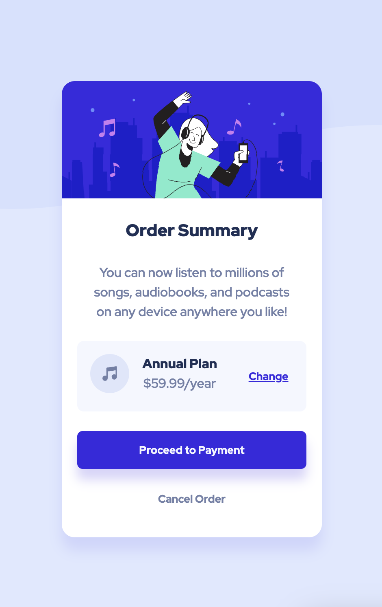

# Frontend Mentor - Order summary card solution

This is a solution to the [Order summary card challenge on Frontend Mentor](https://www.frontendmentor.io/challenges/order-summary-component-QlPmajDUj). Frontend Mentor challenges help you improve your coding skills by building realistic projects.

## Table of contents

- [Overview](#overview)
  - [The challenge](#the-challenge)
  - [Screenshot](#screenshot)
  - [Links](#links)
- [My process](#my-process)
  - [Built with](#built-with)
  - [What I learned](#what-i-learned)
  - [Continued development](#continued-development)
  - [Useful resources](#useful-resources)
- [Author](#author)

## Overview

### The challenge

Users should be able to:

- See hover states for interactive elements

### Screenshot




### Links

- Solution URL: [on Frontend Mentor](https://www.frontendmentor.io/solutions/order-summary-component-RCWx85xtbS)
- Live Site URL: [on Github](https://pykm.github.io/order-summary-card/)

## My process

### Built with

- Semantic HTML5 markup
- CSS custom properties
- Flexbox
- Mobile-first workflow

### What I learned

In this challenge, the image of a woman listening to music is purely decorative, so the icon of music. Therefore I used css to add them to the layout instead of creating image elements.

To add the image of a woman listening to music:

```html
<main>
  <div class="order_summary">
  </div>
</main>
```
```css
main::before{
  content: '';
  display: block;
  width: 100%;
  height: 9em;
  background-image: url('../images/illustration-hero.svg');
  background-position: center;
  background-size: contain;
  border-radius: 1em 1em 0 0;
}
```

It's the first time that I ever used the `margin-left` property to align flex items, so that the first two items appear on the left, and the last item appears on the right:

```html
<div class="order_plan">
  <div class="plan_detail">
    <p class="emphasis_text">Annual Plan</p>
    <p>$59.99/year</p>
  </div>
  <button class="change" type="button" name="button">Change</button>
</div>
```
```css
.plan_detail{
  margin-left: 1em;
}
.change{
  margin-left: auto;
}
```

I also noticed that `font-family` set on body won't do anything for button elements.

### Continued development

Technique that I'm not completely familiar with, can be found in this challenge:
- Using `margin-left` or `margin-right` to split flex items.

Technique that I found useful, although not using in this challenge:
- SASS

### Useful resources

- [Typical use cases of flexbox on MDN](https://developer.mozilla.org/en-US/docs/Web/CSS/CSS_Flexible_Box_Layout/Typical_Use_Cases_of_Flexbox) - This article includes many useful use cases of flexbox, I was using the `margin-left` technique to split flex items.

## Author

- Website - [PYkm](https://pykm.github.io/)
- Frontend Mentor - [@PYkm](https://www.frontendmentor.io/profile/PYkm)
